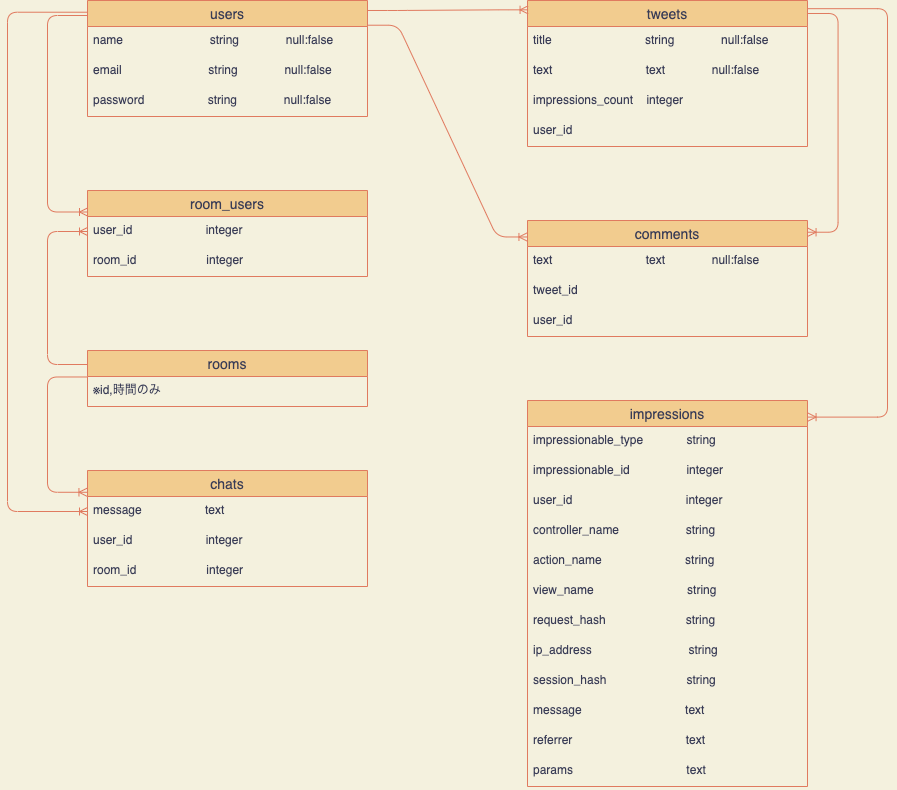

# README

# Latte Gunya 
#### ラテアートの動画・画像が共有出来るアプリです

## アプリケーション概要
- ラテアートの成長に行き詰まっている人の助けになることができます。
- 投稿機能により、他のユーザーの投稿や、動画、画像を見ることができます。
- コメント機能により、他のユーザーの投稿に対してコメントしたり、コメントをもらうことが出来ます。
- 投稿ページでの検索機能により投稿、ユーザーを検索できることができます。
- チャット機能により、他のユーザーにチャットをすることができます。

### URL 
- https://gunya-latte.herokuapp.com/

### テストアカウント
- Email: test1234@test1234
- password: test1234

## 利用方法 
#### ラテアートの動画・画像が共有出来るアプリです。ラテアートの技術的な悩みなどを共有し、問題解決が出来る仕様のアプリとなっております。チャット機能により他の人に知られることなく質問することも可能です。

## 目指した課題解決
#### 私自身がそうだったのですが、周りの人たちに教えてもらえる人がいなかったりすると成長が行き詰まってしまいます。そういった悩みを気軽に相談、解決し、そのラテアートが提供されたお客様まで元気になれるようにと考え作成しました。

## 実装要件

### ユーザー機能
- 新規登録(Name、Email、Passwordを入力)を行い、ログインできるようにしています。
- ログイン(Email、Password)を入力し、ログインできます。
### 投稿機能	
- ユーザーが投稿した投稿を見ることができます。
- タイトル、テキスト、画像(必須)を入力することで投稿できます。
- ログインをしていることが前提です。
### 検索機能
- ログインをしていない状況でも検索することができます。
- 検索した際は、該当する投稿、ユーザーを探し出すことができます。
### コメント機能
- コメントをするには、ログインしていることが前提です。
- 閲覧するのは、ログインしていない状況でも可能です。
- コメントには誰がコメントしたかがわかるようにするために、ニックネームを表示させています。
### プロフィール機能
- ログインしていることが前提です。
- プロフィールを好きなように投稿することができます。
- 投稿された投稿から、投稿者のプロフィールを見ることができます。
- 自身の投稿一覧を確認できます。
### チャット機能
- ログインしていることが前提です。
- チャットボタンを押すと専用のRoomが作成されます。
- テキスト(任意)、画像(任意)を入力することでチャットを投稿することができます。
- 自身、相手ユーザーのチャットを確認できます。
### 実装予定の機能
- ユーザーがラテアート教室などの告知をし、その投稿から応募できるような機能を作成しようと考えています。
# ER図
## テーブル設計
## users テーブル

| Column   | Type   | Options     |
| -------- | ------ | ----------- |
| name     | string | null: false |
| email    | string | null: false |
| password | string | null: false |

### Association

- has_many :tweets
- has_many :comments
- has_many :chats
- has_many :rooms, through: :user_rooms
- has_many :user_rooms

## tweets テーブル

| Column              | Type       | Options                        |
| ------------------- | ---------- | ------------------------------ |
| title               | string     | null: false                    |
| text                | text       | null: false                    |
| user                | references | null: false, foreign_key: true |
| impressions_count   | integer    |                                |
### Association

- belongs_to :user
- has_many :comments
- has_many_attached :images
- is_impressionable counter_cache: true

## comment テーブル

| Column | Type       | Options                        |
| ------ | ---------- | ------------------------------ |
| text   | text       | null: false                    |
| user   | references | null: false, foreign_key: true |
| post   | references | null: false, foreign_key: true |

### Association

- belongs_to :user
- belongs_to :tweet

## chats テーブル

| Column     | Type       | Options                        |
| ---------- | ---------- | ------------------------------ |
| message    | text       |                                |
| room_id    | integer    |                                |
| user_id    | integer    |                                |

### Association

- belongs_to :user
- belongs_to :room
- has_one_attached :image

## user_rooms テーブル
| Column     | Type       | Options                        |
| ---------- | ---------- | ------------------------------ |
| room_id    | integer    |                                |
| user_id    | integer    |                                |

### Association

- belongs_to :user
- belongs_to :room

## rooms テーブル
| Column     | Type       | Options                        |
| ---------- | ---------- | ------------------------------ |
|            |            |                                |
#### ※id、時間のみ

### Association

- has_many :chats
- has_many :room_users
- has_many :users, through: :user_rooms

## impressions テーブル

| Column                | Type       | Options                        |
| --------------------- | ---------- | ------------------------------ |
| impressionable_type   | string     |                                |
| impressionable_id     | integer    |                                |
| user_id               | integer    |                                |
| controller_name       | string     |                                |
| action_name           | string     |                                |
| view_name             | string     |                                |
| request_hash          | string     |                                |
| ip_address            | string     |                                |
| session_hash          | string     |                                |
| message               | text       |                                |
| referrer              | text       |                                |
| params                | text       |                                |

# ER図

